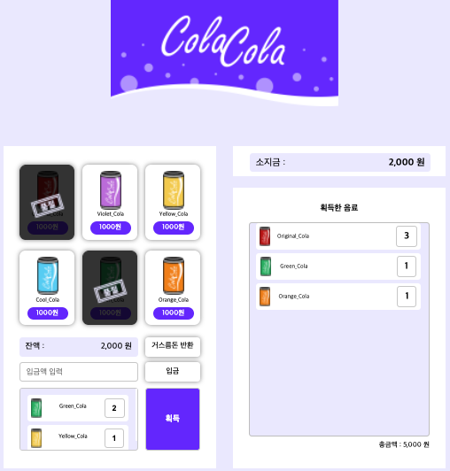

# [Vending Machine Project](https://github.com/qorlgns1/vending-machine)

## 소개

- 목표
  - [피그마 디자인](https://www.figma.com/file/hEyXyA3SDI69DBnfqYZjt9/%EB%A9%8B%EC%82%AC_%ED%94%84%EB%A1%A0%ED%8A%B8%EC%97%94%EB%93%9C%EC%8A%A4%EC%BF%A8_2%EA%B8%B0?node-id=31%3A1214)를 바탕으로 vending machine layout 구현
- 개발기간 : 22.04.08 ~ 진행중
  - 과거 히스토리는 [collection-of-works](https://github.com/qorlgns1/collection-of-works)에 있습니다.
- 현재 자바스크립트로 만든 컴포넌트 단위가 커서 컴포넌트를 클래스단위로 변경하여 적용할 계획을 가지고 진행중입니다.
- [배포 링크](https://qorlgns1.github.io/vending-machine/)

## 주요 기능

1. 처음 시작시 로컬스토리지에 소지금을 10,000원 충전합니다.
2. 입금액을 입력하고 입금을 누르면 잔액에 표시되고 소지금에서 차감됩니다.
3. 잔액으로 장바구니(미니 디스플레이창)에 콜라를 담을 수 있고 하단 미니 디스플레이창에 표시됩니다.
4. 미니 디스플레이창에서 콜라를 누르면 제거할 수 있습니다.
5. 장바구니에 담긴 콜라는 획득버튼을 누르면 획득한 음료에 표시됩니다.
6. 획득한 음료의 총 금액은 우측 디스플레이 하단에 표시됩니다.
7. 자판기의 콜라는 최대 3개로 설정되어 있습니다. 3개를 장바구니에 담거나 획득하면 콜라는 품절표시로 보여지고, 더 이상 구매할 수 없습니다.
8. 남은 잔액은 거스름돈 반환을 누르면 남은 소지금에 더해집니다.
9. reset: 소지금을 0원으로 만들고 새로고침하면 소지금을 10,000원으로 새롭게 충전합니다.

## 기술 스택

- HTML
- CSS
- Vanilla Javscript
- Git

## 참여

|                                                             배기훈                                                             |
| :----------------------------------------------------------------------------------------------------------------------------: |
|  |
|                                            [qorlgns1](https://github.com/qorlgns1)                                             |
|                                                          Web Frontend                                                          |

**배기훈**

- Semantic Web을 만들기 위한 HTML 작성
- Responsive Web을 만들기 위한 CSS 작성
- 모듈화를 적용한 Vanilla Javscript 작성
- Git Commit Message Convention 사용

## 느낀점

- 모듈을 나누고 싶어 작업했는데 현재 생각처럼 나누어지지 않아 아쉬움이 있습니다.
